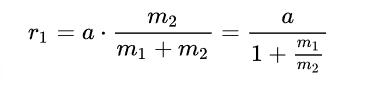
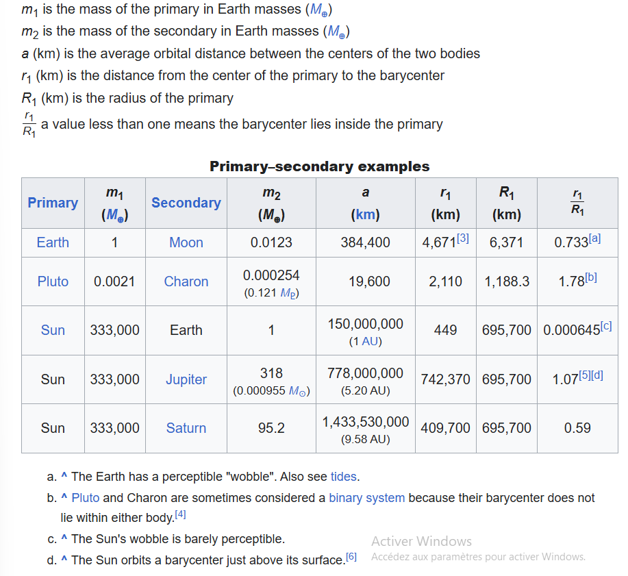
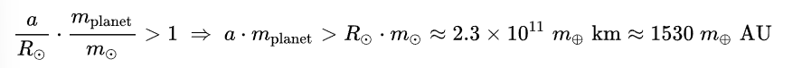
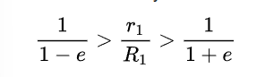

## Barycenter

A barycenter is a point, more precisly the center of two or more masses.

It is a dynamic point and can be calculated by the **two body problem**

---

case scenario

object1 = less massive object
object2 = much more massive

If object1 is close to object2 then the barycenter will be in object2 and it will look as if object1 have an orbit around object2,  while object2 will wobble lightly

If object 1 is far away the barycenter can be located outside of the massive object 

then if object1 get heavier and heavier the barycenter will be more and more located between them

---

**Two body problem**

To determine barycenter which is one of the foci
of the elliptical orbit of each body.

* r1 is the distance from the primary center to the barycenter
* a is the disance between the centers of the two bodies
* m1 and m2 are the masses of the two bodies 

The semi major axis (the smallest diameter from an elipse) is given by  

**r2 = a-r1**

**Primary - secondary example**

**Example with the sun**

if m1 >> m2 then the ratio r1/R1 will be about :

(a/r1) x (m2/m1)

thus the barycenter of the planet will be outside the sun only if 

To calculate the actual motion of the sun we need to take account of the four giants (jupiter, saturn, uranus, neptune), smaller planet contribution are negligible. 

It needs to be at least 0.04 times the mass of the star to have a decent impact (m_body/m_star)

The calculations above are based on the mean distance between two body. However celestial body have elliptical oribits.

This implies that a secondary body will have an apses:
* Apogee further to primary
* perigee closest to primary

The difference between the apses depends on the , e.

In some case a barycenter can vary between inside and outside the primary body, this occurs where 

