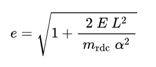
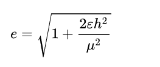
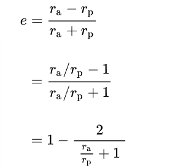
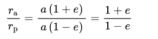

## Orbital Eccentricity

It's a dimensionless parameter that determines how far an orbit deviates from a perfect circle.

It's defined between 0 and 1, 0 is a perfect circle then more and more eliptic as we get close to 1, then parabolic (escape/capture orbit) if greater than 1 it's an hyperbola.

This term's name derives from the parameters of conic section, becase every kepler orbit is one.

It's often use for the two body problem but can be used for objects following a  orbit through the galaxy


### Definition

In a two body problem (with inverse square law force), every orbit is a Kepler orbit, it's eccentricity is a non negative number.

The eccentricity e is given by:



* E is the total [orbital energy](https://en.wikipedia.org/wiki/Orbital_energy)
* L is the [angular momentum](https://en.wikipedia.org/wiki/Angular_momentum) 
* m_rdc us the [reduced mass](https://en.wikipedia.org/wiki/Reduced_mass)
  
* alpha is the coefficient of the inverse square law [central force](https://en.wikipedia.org/wiki/Central_force), such as in the theory of gravity or electrostatics in classical physics:
    ```
    F = alpha/r^2
    ```
    if alpha is positive than the force is repulsive and negative for an attractive force 

in the case of a gravitational force: 


* Epsilon is the [specific orbital energy](https://en.wikipedia.org/wiki/Specific_orbital_energy) (total energy/reduced mass)
* µ is [the standard gravitational parameter](https://en.wikipedia.org/wiki/Standard_gravitational_parameter) based on the total mass
* h the specific relative angular moment (angular momentum/reduced mass)

For eliptical orbits, arcsin(e) gives the projection of a perfect circle to an ellipse.


### Calculation 

The eccentricity of an orbit can be calculated from the [orbital state vector](https://en.wikipedia.org/wiki/Orbital_state_vectors) as the magnitude of the eccentricity vector

e = |**e**|

where **e** is the eccentricity vector


for elliptical orbits it can also be calculated from the periapsis and apoapsis with :
* r_p = a(1-e)
* r_a = a(1+e)

where a is the length of the semi-major axis.




the eccentricity of an elliptical orbit can be used to obtain the ratio of the apoapsis radius to the periapsis radius:



____

[source](https://en.wikipedia.org/wiki/Orbital_eccentricity)